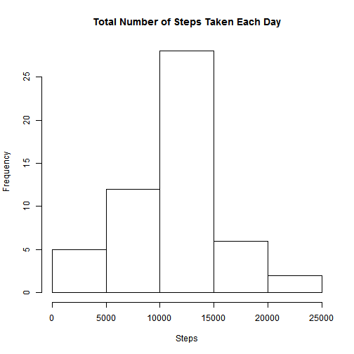
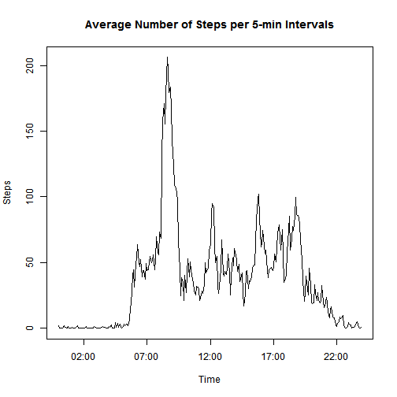
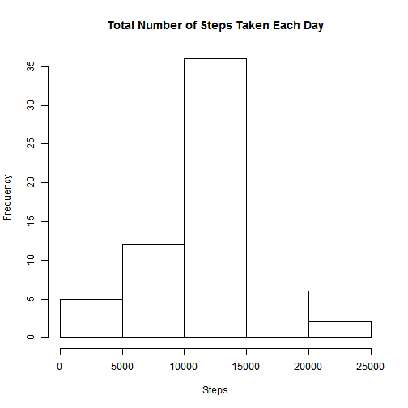
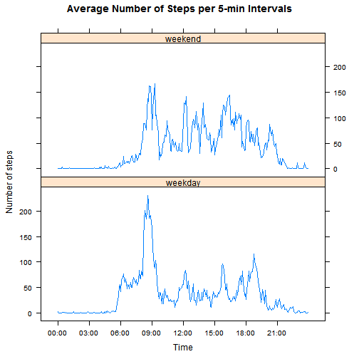

---


## Loading and preprocessing the data

*Note: Download the [Activity monitoring data](https://d396qusza40orc.cloudfront.net/repdata%2Fdata%2Factivity.zip) and unzip it into a working directory.*

Read the dataset into R:

```r
act <- read.csv("activity.csv")
```


Process/transform the data (if necessary) into a format suitable for your analysis:

```r
act$interval <- substr(as.POSIXct(sprintf("%04.0f", act$interval), format='%H%M'), 12, 16)
```


---

## What is mean total number of steps taken per day?


1. Make a histogram of the total number of steps taken each day.

* First, load `dplyr` package needed for analysis:

```r
library(dplyr)
```

```
## 
## Attaching package: 'dplyr'
## 
## The following object is masked from 'package:stats':
## 
##     filter
## 
## The following objects are masked from 'package:base':
## 
##     intersect, setdiff, setequal, union
```

* Second, group observations by `date` and calculate the total for each day:

```r
actD <- group_by(act, date)
actDT <- summarise(actD, steps=sum(steps))
```

* Finally, create a histogram:

```r
hist(actDT$steps, main="Total Number of Steps Taken Each Day", xlab="Steps")
```

 


2. Calculate and report the mean and median total number of steps taken per day:

```r
mean(actDT$steps, na.rm=T)
```

```
## [1] 10766.19
```

```r
median(actDT$steps, na.rm=T)
```

```
## [1] 10765
```


---

## What is the average daily activity pattern?

1. Make a time series plot (i.e. `type = "l"`) of the 5-minute interval (x-axis) and the average number of steps taken, averaged across all days (y-axis).

* Calculate the mean for each 5-minute `interval` averaged across all days:

```r
actI <- aggregate(steps ~ interval, data=act, mean)
```

* Load `zoo` package needed for analysis:

```r
library("zoo")
```

```
## 
## Attaching package: 'zoo'
## 
## The following objects are masked from 'package:base':
## 
##     as.Date, as.Date.numeric
```

* Create a datetime vector using `interval` variable and combine it with the dataset of means for each 5-minute interval averaged across all days into a `zoo` object:

```r
d <- as.POSIXct(paste("2012-10-01", actI$interval))
actID <- zoo(actI$steps, d)
```

* Plot the data:

```r
plot(actID, type="l", xlab="Time", ylab="Steps", 
     main= "Average Number of Steps per 5-min Intervals")
```

 

2. Which 5-minute interval, on average across all the days in the dataset, contains the maximum number of steps?

```r
actI[actI$steps == max(actI$steps),1]
```

```
## [1] "08:35"
```


---


## Imputing missing values

1. Calculate and report the total number of missing values in the dataset (i.e. the total number of rows with `NA`):

```r
sum(is.na(act$steps))
```

```
## [1] 2304
```

2. Devise a strategy for filling in all of the missing values in the dataset.

A simple strategy for imputing missing values was chosen: `NAs` were replaced by the mean for that 5-minute interval averaged across all days. These values were already computed in the previous exercise.

Arguably, this is more accurate than using the mean/median for that day because, as can be seen from the data, number of steps differs a lot during the 24 hours of any given day, but it is much more consistent for any given 5-minute interval across all days.  


```r
actM <- merge(act, actI, by="interval")
colnames(actM)[c(2, 4)] <- c("steps", "mu.steps")
na <- which(is.na(actM$steps)==TRUE)
actM$steps[na] <- actM$mu.steps[na]
```

3. Create a new dataset that is equal to the original dataset but with the missing data filled in.

```r
actM$mu.steps <- NULL
actM <- actM[with(actM, order(date)),]
rownames(actM) <- seq(length=nrow(actM))
actNew <- actM[, c(2, 3, 1)] 
```

4. Make a histogram of the total number of steps taken each day and Calculate and report the mean and median total number of steps taken per day.

* Calculate the total number of steps taken each day:

```r
actNewDT <- aggregate(steps ~ date, data=actNew, sum)
```

* Create a histogram:

```r
hist(actNewDT$steps, main="Total Number of Steps Taken Each Day", xlab="Steps")
```

 

* Calculate and report the mean and median total number of steps taken per day.

```r
mean(actNewDT$steps)
```

```
## [1] 10766.19
```

```r
median(actNewDT$steps)
```

```
## [1] 10766.19
```


---


## Are there differences in activity patterns between weekdays and weekends?

1. Create a new factor variable in the dataset with two levels - `weekday` and `weekend` indicating whether a given date is a weekday or weekend day.

* Set system locale time to `English`:

```r
Sys.setlocale("LC_TIME", "English")
```

```
## [1] "English_United States.1252"
```

* Create a new variable `wk` indicating weekday:

```r
actNew$wk <- weekdays(as.Date(actNew$date))
```

* Change weekdays to `weekday` and weekend days to `weekend`:

```r
actNew$wk <- gsub("Monday", "weekday", actNew$wk)
actNew$wk <- gsub("Tuesday", "weekday", actNew$wk)
actNew$wk <- gsub("Wednesday", "weekday", actNew$wk)
actNew$wk <- gsub("Thursday", "weekday", actNew$wk)
actNew$wk <- gsub("Friday", "weekday", actNew$wk)
actNew$wk <- gsub("Saturday", "weekend", actNew$wk)
actNew$wk <- gsub("Sunday", "weekend", actNew$wk)
```

* Transform `wk` into a factor variable with two levels: `weekday` and `weekend`:

```r
actNew <- transform(actNew, wk=factor(wk))
```

2. Make a panel plot containing a time series plot (i.e. `type = "l"`) of the 5-minute interval (x-axis) and the average number of steps taken, averaged across all weekday days or weekend days (y-axis).

* Calculate the mean for each 5-minute `interval` averaged across `weekday`/`weekend`:

```r
actNewID <- group_by(actNew, interval, wk)
actNewIDM <- summarise(actNewID, mean=mean(steps))
```

* Create a datetime vector using `interval` variable and column bind it with the dataset of means for each 5-minute interval averaged across `weekday`/`weekend`:      

```r
d <- as.POSIXct(paste("2012-10-01", actNewIDM$interval))
actNewIDMD <- cbind(actNewIDM, d)
```

* Load `lattice` package and make a panel time series plot (i.e. `type = "l"`) of the 5-minute interval (x-axis) and the average number of steps taken, averaged across all weekday days or weekend days (y-axis):

```r
library(lattice)
xyplot(mean ~ d | wk, data=actNewIDM, type="l", layout=c(1, 2), 
       scales=list(x=list(at=seq(actNewIDMD$d[1], actNewIDMD$d[576], by="3 hour"), 
                          labels=format(seq(actNewIDMD$d[1], actNewIDMD$d[576], 
                                            by="3 hour"), "%H:%M"))), xlab="Time", 
       ylab="Number of steps", main="Average Number of Steps per 5-min Intervals")   
```

 
